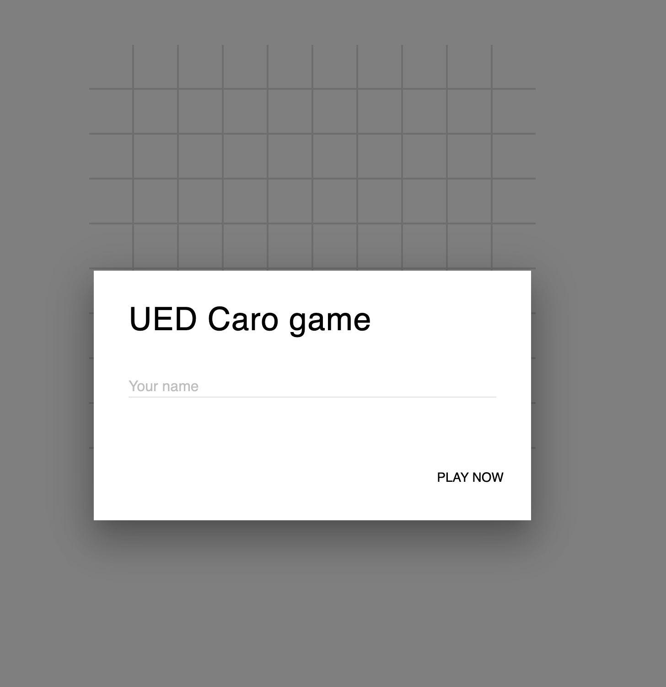
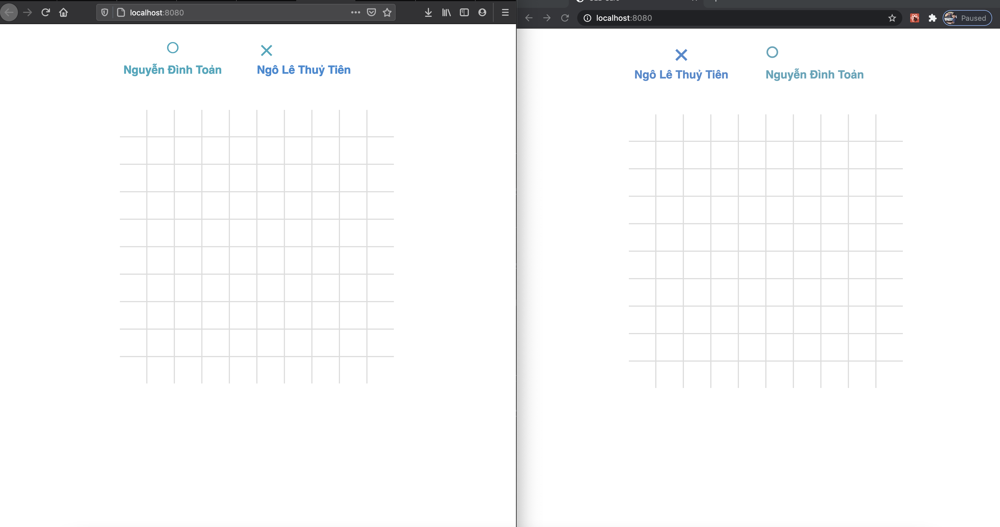
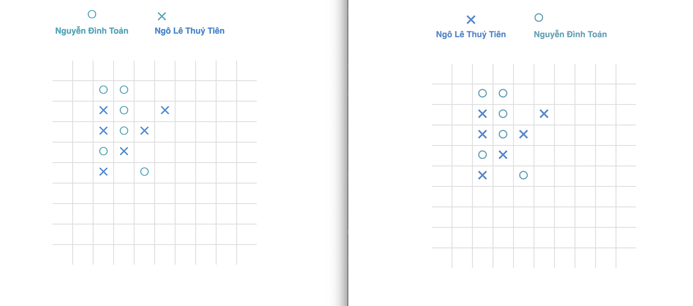
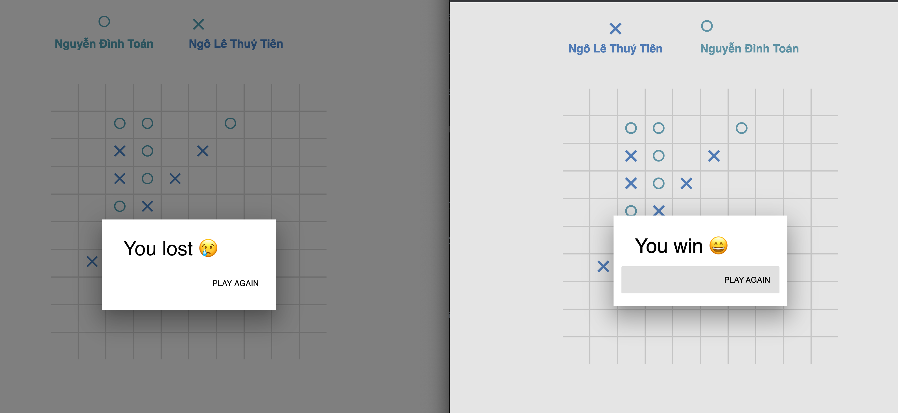

# Chương trình trò chơi Caro

Chương trình trò chơi Caro online do nhóm SV trường DHSP Đà Nẵng Thực Hiện

Giảng viên hướng dẫn

* Lê Văn Mỹ

Nhóm sinh viên thực hiện:

* Nguyễn Đình Toản 18CNTT04
* Đào Ngọc Khuê 18CNTT04
* Huỳnh Văn Sang 18CNTT04
* Ngô Lê Thuỷ Tiên 18CNTT04
* Nguyễn Thị Tường Lê 18CNTT04
* Lê Thị Thanh Truyền 18CNTT04

## Giới thiệu

Trò chơi Caro được chia làm 2 phần cơ bản

### Phần server side

Phần backend dùng JAVA Spring và Socket. Socket Server được dùng để làm trung gian trao đổi thông tin message giữa các
người chơi với nhau

Ví dụ 1 dạng tín hiệu message được truyền đi khi có người tham gia vào trò chơi

```
{"topic":"join","payload":{"name":"Ngo Le Thuy Tien","players":["Toan Nguyen Dinh","Ngo Le Thuy Tien"]}}
```

Dạng tín hiệu trao đổi giữa 2 người chơi với nhau để thể hiện nước cờ đi của người này hoặc người kia có dạng như sau

```
{"topic":"play","payload":{"player":0,"x":1,"y":1}}
```


### Phần client side

Được phát triển dựa trên HTML/Javascript, có sử dụng thư viện React.js với các tính năng có sẳn như sau:

#### Nhập tên để tham gia vào trò chơi
Giao diện khi vào sẽ yêu cầu người chơi nhập tên của mình.



#### Khi đã đủ 2 người thì bắt đầu trò chơi.

Dưới đây là 2 người chơi được thử nghiệm trên 2 trình duyệt



 Người chơi tiến hành đi các nước cờ của mình 



Sau mỗi nước cờ đi, hệ thống sẽ được tính toán thắng tại vị trí vừa đánh, bằng cách kẽ 4 đường thẳng đi qua điểm chơi hiện tại, và đếm lượt đi nếu đủ 5 quân liên tiếp, thì sẽ thống báo thắng thua.




## Ưu điểm

* Thuật toán kiểm tra thắng thua nhanh, với độ phức tạp O(n), trong đó n là cạnh hình vuông của bàn cờ.
* Giao diện gọn nhẹ, và tối ưu, bắt mắt.

## Chức năng cần bổ sung 

Do thời gian có hạn, nên chúng em còn chưa kịp bổ sung nhiều chức năng như 
* Hỗ trợ chat giữa 2 người chơi.
* Tính năng mời người chơi, và nhiều ván cờ song song.

## Thank you!


